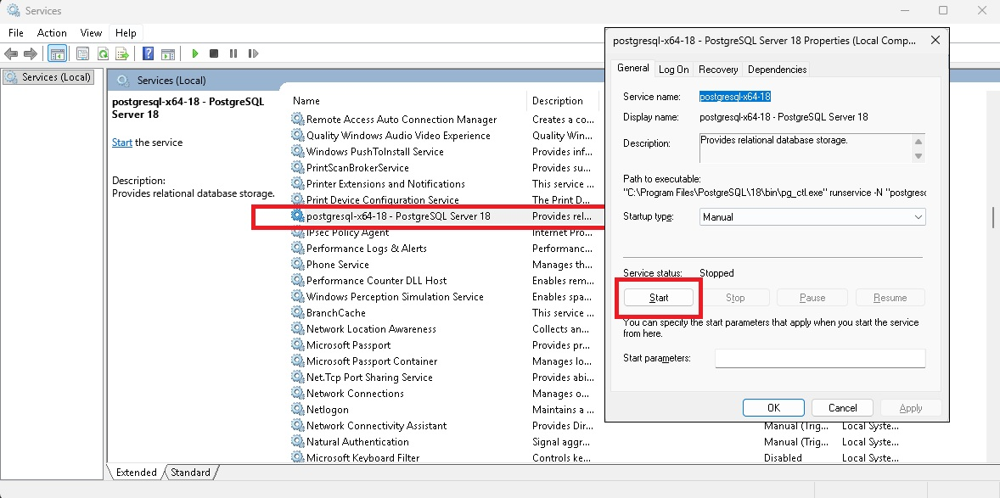
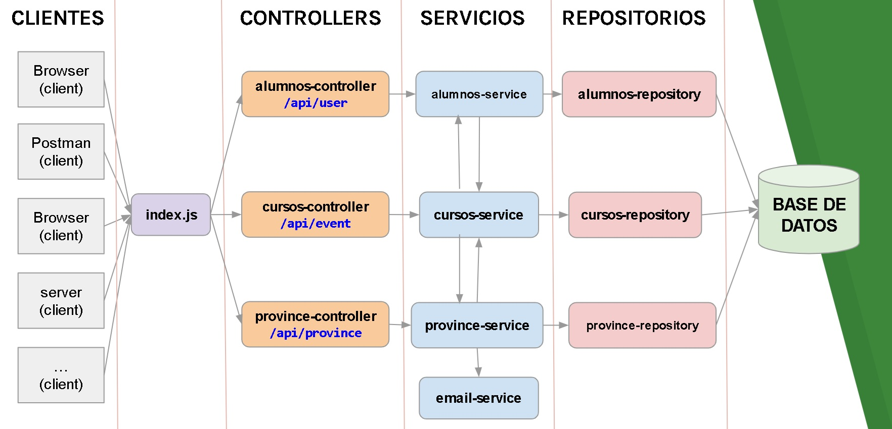

# API REST de Alumnos y Cursos — Express + PostgreSQL

Proyecto educativo de la materia **DAI** (ORT). Una API REST que hace CRUD de alumnos y cursos contra PostgreSQL, construida con una **arquitectura en capas** (controller → service → repository) y una clase helper de acceso a datos (`DbPg`) que aísla todo el boilerplate de PostgreSQL.

El código es intencionalmente verboso y autoexplicativo, con comentarios pensados para que los estudiantes entiendan cada paso.

> 📖 El repositorio incluye además **4 documentos de explicación** (en `documents/`) que reconstruyen, paso a paso, cómo se llegó desde "todo en un archivo" hasta esta arquitectura en capas. Ver la sección [Documentación — Guía de lectura](#-documentación--guía-de-lectura).

---

## 🗂️ Estructura del proyecto

```
src/
├── server.js                   ← Configura Express y monta los controllers
├── controllers/                ← Reciben el request HTTP, llaman al service, responden
│   ├── alumnos-controller.js
│   └── cursos-controller.js
├── services/                   ← Lógica de negocio (calcular edad, validar curso)
│   ├── alumnos-service.js
│   └── cursos-service.js
├── repositories/               ← Acceso a datos (SQL puro a través de DbPg)
│   ├── alumnos-repository-new.js
│   ├── cursos-repository-new.js
│   └── db-pg.js                ← Clase helper para PostgreSQL (Pool + try/catch + log)
├── entities/                   ← Clases que representan las tablas
│   ├── alumno.js
│   └── curso.js
├── configs/
│   └── db-config.js            ← Configuración de conexión a PostgreSQL
└── helpers/
    └── log-helper.js           ← Logueo de errores a archivo y/o consola
```

---

## 🚀 Cómo arrancar

### 1. Tener PostgreSQL corriendo

En Windows, el servicio de PostgreSQL tiene que estar iniciado. Si no arranca, abrí **Servicios** (`services.msc`), buscá el servicio de PostgreSQL (por ejemplo `postgresql-x64-18`) y dale **Start**:



### 2. Crear la base de datos y cargar datos

Abrí **pgAdmin** o cualquier cliente de PostgreSQL y ejecutá el script:

```
documents/database/script-postgress.sql
```

Este archivo crea las tablas `cursos` y `alumnos`, y las llena con datos de ejemplo (135 alumnos repartidos en 5 cursos).

### 3. Configurar la conexión

La configuración de conexión vive en `src/configs/db-config.js`.

> ⚠️ **Importante**: hoy `db-config.js` usa **credenciales hardcodeadas** (`host`, `database`, `user`, `password`, `port`). El bloque comentado al final del archivo muestra la versión que lee las variables desde `process.env` (dotenv). Si querés usar `.env`, copiá `.env-template` como `.env`, completá tus datos y descomentá ese bloque.

```env
DB_HOST       = "localhost"
DB_DATABASE   = "dai-2025"
DB_USER       = "postgres"
DB_PASSWORD   = "root"
DB_PORT       = 5432
PORT          = 3000
```

### 4. Instalar dependencias y ejecutar

```bash
npm install
npm run server
```

El script `server` usa `node --watch`, así que recarga solo al guardar cambios. La API queda escuchando en `http://localhost:3000`.

### 5. Probar con Postman

Importá la colección de Postman que está en:

```
documents/postman/DAI - PG - Alumnos-cursos.postman_collection.json
```

Tiene requests para todos los endpoints, incluyendo casos de error (404, 400).

---

## 🌐 Endpoints

Tanto `alumnos` como `cursos` siguen el mismo patrón CRUD:

| Método | Ruta | Descripción | Status |
|--------|------|-------------|--------|
| GET | `/api/alumnos` | Listar todos los alumnos | 200 |
| GET | `/api/alumnos/:id` | Obtener un alumno por ID | 200 / 404 |
| POST | `/api/alumnos` | Crear un alumno (body JSON) | 201 / 400 |
| PUT | `/api/alumnos/:id` | Modificar un alumno | 200 / 404 |
| DELETE | `/api/alumnos/:id` | Eliminar un alumno | 200 / 404 |
| GET | `/api/alumnos/test-insert` | Ejemplo: crear un alumno desde código | 201 |

Lo mismo para `/api/cursos` (sin el `test-insert`).

---

## 🏗️ Arquitectura en capas



```
Postman / Browser
       │
       ▼
    server.js                  → Configura Express, monta controllers
       │
  ┌────┴────┐
  ▼         ▼
Controller  Controller         → Recibe req, llama al service, responde con status code
  │         │
  ▼         ▼
Service     Service            → Lógica de negocio (calcular edad, validar que el curso existe)
  │         │
  ▼         ▼
Repository  Repository         → SQL puro, ejecutado a través de DbPg
  │         │
  ▼         ▼
      DbPg                      → Pool de PostgreSQL + try/catch + LogHelper
       │
       ▼
   PostgreSQL
```

**Regla clave**: cada capa solo habla con la de abajo. El controller no sabe de SQL, el repository no sabe de HTTP, y el service no sabe de ninguno de los dos.

### Cómo se ve cada capa

```js
// Controller — solo HTTP
router.get('/:id', async (req, res) => {
    const alumno = await currentService.getByIdAsync(req.params.id);
    res.status(StatusCodes.OK).json(alumno);
});

// Service — lógica de negocio
getByIdAsync = async (id) => {
    const alumno = await this.AlumnosRepository.getByIdAsync(id);
    return agregarEdad(alumno);     // calcula la edad al vuelo
}

// Repository — SQL puro a través de DbPg
getByIdAsync = async (id) => {
    return await this.db.queryOne(`SELECT * FROM alumnos WHERE id=$1`, [id]);
}
```

`AlumnosService` depende de `CursosService` para validar la FK (`id_curso`) antes de insertar o modificar un alumno.

---

## 🧰 La clase `DbPg` — helper de acceso a datos

Los repositories no tocan el `Pool` de `pg` directamente: usan una instancia de `DbPg`, que concentra el boilerplate repetido (crear el Pool, `try/catch`, logueo de errores, extraer `.rows`) en una interfaz de **4 métodos**:

| Método | Devuelve | Uso |
|--------|----------|-----|
| `queryAll(sql, values?)` | array de filas (o `null`) | listados (`SELECT *`) |
| `queryOne(sql, values?)` | una fila (o `null`) | buscar por id |
| `queryReturnId(sql, values?)` | el `id` generado (o `0`) | `INSERT ... RETURNING id` |
| `queryRowCount(sql, values?)` | cantidad de filas afectadas (o `0`) | `UPDATE` / `DELETE` |

Así el repository queda reducido a SQL:

```js
import DbPg from './db-pg.js';

getAllAsync = async () => {
    return await this.db.queryAll(`SELECT * FROM cursos`);
}
```

El `Pool` se crea **una sola vez** (lazy init) y se reutiliza en todas las consultas.

---

## 📦 Carpeta `entities/` — Clases de dominio

Las clases `Alumno` y `Curso` representan las entidades de la base de datos. Sirven para crear objetos desde código (no solo desde `req.body`):

```js
import Alumno from './../entities/alumno.js'

// En vez de depender de lo que manda el cliente...
const nuevoAlumno = new Alumno('Willy', 'Wonka', 1, '2005-07-15', true);
const newId = await currentService.createAsync(nuevoAlumno);
```

Podés ver esto funcionando en el endpoint `GET /api/alumnos/test-insert`.

---

## 📚 Documentación — Guía de lectura

En `documents/` hay **4 documentos** que reconstruyen la evolución del código: arrancan con "todo en un archivo" y llegan, paso a paso, hasta la arquitectura en capas con la clase `DbPg` que ves hoy en `src/`. Cada uno analiza una versión, explica sus problemas y cómo la siguiente los resuelve.

> 📌 **Nota**: el código de las versiones intermedias (V1 a V3) ya no está en `src/` — el repositorio contiene solo la versión final. Los documentos sirven para entender *por qué* el código terminó así.

### Recorrido recomendado

```
 V1                    V2                       V3                        V4 (versión actual)
 server-noob    →    server-noob-mejorada  →   server (capas)    →     db-pg / DbPg
 ┌──────────┐        ┌──────────────────┐      ┌──────────────┐        ┌──────────────┐
 │ 1 archivo│        │ Router + Pool    │      │ controller   │        │ clase Db     │
 │ Client   │        │ varios archivos  │      │ service      │        │ helper       │
 │ todo     │        │ sin finally      │      │ repository   │        │ 4 métodos    │
 │ junto    │        │                  │      │ dotenv       │        │ reutilizable │
 └──────────┘        └──────────────────┘      └──────────────┘        └──────────────┘
```

| # | Documento | Qué explica |
|---|-----------|-------------|
| 1 | [Server Noob — Análisis de la versión inicial](documents/server-noob-explicacion.md) | Los problemas de meter todo en un solo archivo: `Client` vs `Pool`, código repetido, credenciales hardcodeadas, etc. |
| 2 | [Server Noob Mejorada — Router + Pool](documents/server-noob-mejorada-explicacion.md) | Cómo separar endpoints con `Router`, reemplazar `Client` por `Pool`, y eliminar el `finally` problemático. |
| 3 | [Server con Capas — Controller, Service, Repository](documents/server-capas-explicacion.md) | Arquitectura en 3 capas, variables de entorno con dotenv, lógica de negocio en el service (calcular edad, validar FK). |
| 4 | [DbPg — Clase helper de acceso a datos](documents/db-pg-explicacion.md) | Extraer el boilerplate repetido de los repositories en una clase `Db` reutilizable de 4 métodos. |

> 💡 Cada documento asume que ya leíste el anterior. Si salteás alguno, no vas a entender *por qué* se hace el cambio.

---

## 🗄️ Base de datos

### Tablas

| Tabla | Columnas |
|-------|----------|
| `cursos` | `id` (SERIAL PK), `nombre` |
| `alumnos` | `id` (SERIAL PK), `nombre`, `apellido`, `id_curso` (FK → cursos), `fecha_nacimiento`, `hace_deportes` |

### Scripts

| Archivo | Qué hace |
|---------|----------|
| `documents/database/script-postgress.sql` | Crea las tablas e inserta 5 cursos + 135 alumnos |

---

## 🧪 Postman

La colección para probar la API está en:

```
documents/postman/DAI - PG - Alumnos-cursos.postman_collection.json
```

Incluye requests para todos los endpoints con ejemplos de happy path y casos de error.

---

## 📦 Dependencias

```bash
npm install express            # framework web (Express 5)
npm install cors               # habilitar CORS
npm install pg                 # driver PostgreSQL
npm install dotenv             # variables de entorno desde .env
npm install http-status-codes  # constantes legibles (StatusCodes.OK vs 200)
```

El proyecto usa **ESM** (`"type": "module"`) y `node --watch` para el reinicio automático en desarrollo (no necesita nodemon).
